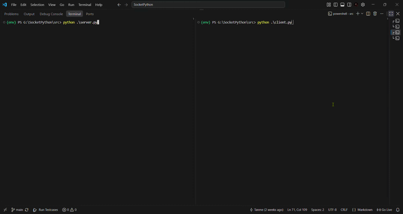

# babel

**[read the full technical write-up here :)](https://tanmaydawande.tech/blog/2026-09-18-babel-tcp.html)**



A TCP chat protocol built from python sockets, with RSA used for establishing an AES-GCM session. The RSA math (key generation arithmetic, modular exponentiation) and the OAEP padding are written by hand. The only library pieces are pycryptodome's prime generator and AES-GCM.

## What this is

Started as a plain socket chat script and turned into a small cryptography project. Instead of wrapping the connection in TLS, the goal was to build the handshake myself: generate real RSA keypairs, do the modular exponentiation and OAEP padding by hand, use that to bootstrap a proper AES-256-GCM session, and see where the protocol actually breaks.

It broke a few times. That's mostly the point.

## How it works

```
Client                              Server
  |----- RSA public key (N,e) ------>|
  |<---- RSA public key (N,e) -------|
  |<------------- ACK ---------------|
  |-- AES-256 key, RSA-OAEP wrapped->|
  |<===== AES-GCM chat stream ======>|
```

1. **Framing.** Every message on the wire gets a 4-byte, network-byte-order length prefix (`struct.pack("!I", len(payload))`), so the receiving side knows how many bytes belong to the message instead of guessing at TCP's stream boundaries.
2. **Handshake.** Client and server each generate their own 2048-bit RSA keypair (two random 1024-bit primes multiplied together for N) and exchange public keys `(N, e)` in the clear. This step isn't meant to secure the whole conversation, just to get a key to wrap the next thing in. Right now only the server's key is used for that; the client's is exchanged but not yet put to work.
3. **Session key.** The client generates a random 256-bit AES key, pads it with RSA-OAEP (SHA-256, MGF1-SHA-256, empty label, implemented by hand), encrypts it under the server's RSA public key, and sends it once. OAEP's random seed means the same key encrypts to a different ciphertext every time, which closes off the determinism and malleability problems of textbook RSA. With a 2048-bit key, OAEP/SHA-256 can carry up to 190 bytes, plenty for a 32-byte AES key. From that point on both sides share a symmetric key that was never sent as plaintext.
4. **Transport.** Chat messages are encrypted with AES-256-GCM: a fresh random nonce per message, shipped as `nonce || tag || ciphertext`. The GCM tag means a tampered packet gets rejected instead of silently decrypting into garbage.

All of this lives in `SecureNODE`, a class that wraps a raw socket and exposes clean methods so `client.py` and `server.py` only deal with UI and connection lifecycle, not the math.

## Project layout

```
src/
  server.py / client.py   UI and connection lifecycle
  secure_node.py          SecureNODE: framing, handshake, encrypted send/receive
  crypto_engine.py        RSA encrypt/decrypt around OAEP, AES-GCM helpers
  oaep.py                 OAEP padding (SHA-256, MGF1) from scratch
  rsa_encrypt.py          RSA key generation
docs/writeup.txt          the math, worked out by hand
```

## Running it

Only external dependency is pycryptodome.

```bash
pip install pycryptodome

# terminal 1
python src/server.py --host 127.0.0.1 --port 65432

# terminal 2
python src/client.py --host 127.0.0.1 --port 65432
```

## Known limitations

- MITM attacks can be carried out easily with the interceptor exchanging their own keys. No way to authenticate identity yet.
- No replay protection: messages carry no sequence numbers and both directions share one AES key, so a captured message can be replayed or reflected.
- RSA and OAEP are hand-written for learning. They aren't constant-time and haven't been audited, so don't use this to protect anything real.
- Reads use a single `recv()` per frame, so on a real network a frame could arrive split. Fine on localhost, needs a read-until-complete loop.
- A tampered or malformed packet ends the session with a traceback instead of closing cleanly.
- The chat loop is a strict send-then-receive ping-pong, no threading yet, so you can't type while waiting on the other side. An empty message on the server side stalls both ends.
- RSA keygen can very rarely fail at startup (about 1 run in 33,000) when 65537 shares a factor with the totient. Just rerun.
- One client, one server, one connection at a time.

## What's next

- Authenticate the handshake (signatures, which would finally use the client's keypair, or pinned key fingerprints) so a MITM can't swap keys
- Swap the static RSA session key for ECDH, so one compromised session doesn't compromise the ones before it
- Thread the chat loop for real full-duplex messaging
- Multi-client support on the server

The full math (Euler's totient, why the tag in AES-GCM matters, why RSA overflowed on longer messages before AES came in) is worked out by hand in `docs/writeup.txt`.